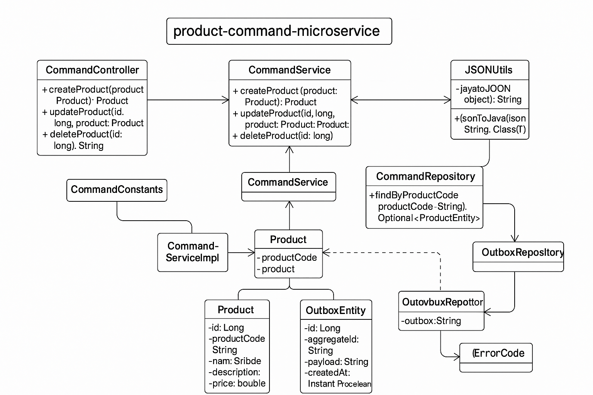

### 🔷 1. System Architecture Diagram


### 🔷 2. Component Responsibilities
````
Component                            Responsibility
---------------------------------------------------------------------------------------------------
REST Controller	                     Exposes /create, /update, /delete, /full-load APIs.

CommandService                       Business logic; saves data to DB and sends event to Kafka

CommandRepository                    Interacts with MySQL using Spring Data JPA

ProductEvent                         Java object containing eventType and product details
````

### 🔷 3. Flow Chart (Step-by-Step)
````
+-------------+       +-----------------+       +-----------------+       +------------------+
|   Client    | --->  | CommandService  | --->  | CommandRepository| ---> | ProductEntity DB |
|  (API Call) |       |  (Service Impl) |       |  OutboxRepository| ---> |  OutboxEntity DB |
+-------------+       +-----------------+       +------------------+       +------------------+
                                     |
                                     v
                             ProductEvent (JSON)
                                     |
                                     v
                              OutboxEntity (event + meta)
````
### 🔷 4. Class Diagram


### Note:
````
This is 1st service Producer:

Sceduler: second Service is https://github.com/tamitkumar/product-command-microservice/tree/master/order-poller
Consumer: third Service is https://github.com/tamitkumar/product-query-microservices

````
