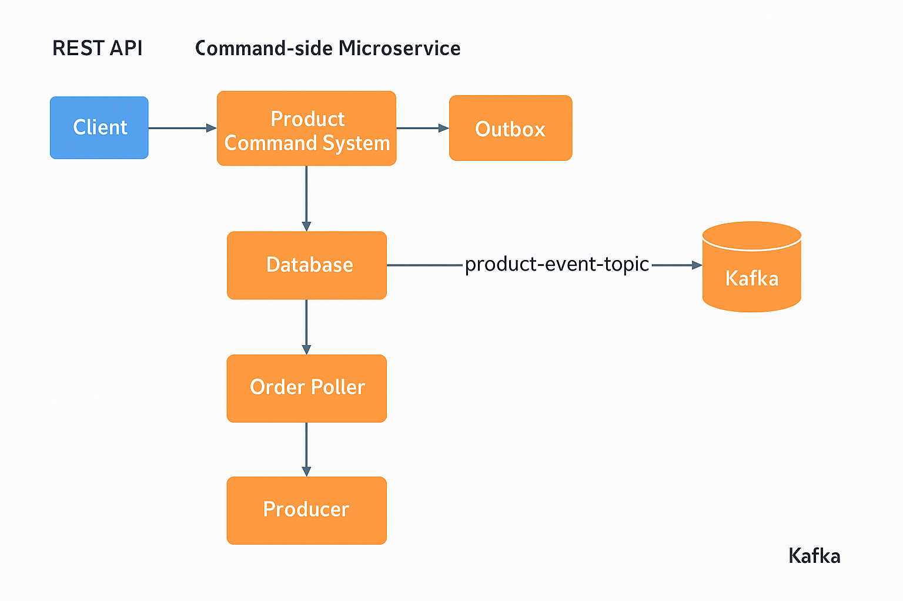

### 🔷 Purpose:
To persist product events in an outbox table, and publish them to Kafka safely using the Transactional Outbox Pattern.
### 🔷 1. System Architecture Diagram


### 🔷 2. Class Diagram
````
                          +-------------------------+
                          |  OrderPollerApplication |
                          |-------------------------|
                          | Starts Spring Boot App  |
                          +-------------------------+
                                      |
                                      v
                          +-------------------------+
                          |   OrderPollerService    |  @Scheduled Task
                          |-------------------------|
                          | pollOutboxMessagesAnd   |
                          | Publish()               |
                          +-------------------------+
                                      |
    +---------------------------- fetch unprocessed -----------------------------+
    |                                                                            |
    v                                                                            |
+------------------------+                                                       |
|   OutboxRepository     |                                                       |
|------------------------|                                                       |
| findByProcessedFalse() |                                                       |
+------------------------+                                                       |
    |                                                                            |
    +---------------------------- returns List<OutboxEntity> -------------------+
                                      |
                            For each OutboxEntity:
                                      |
                                      v
                      +----------------------------+
                      |         JSONUtils          |
                      |----------------------------|
                      | jsonToJava(payload, clazz) |
                      +----------------------------+
                                      |
                                      v
                      +----------------------------+
                      |     MessagePublisher       |
                      |----------------------------|
                      | publish(ProductEvent)      |
                      +----------------------------+
                                      |
                                      v
                      +----------------------------+
                      |      KafkaTemplate         |
                      |----------------------------|
                      | send(topic, event)         |
                      +----------------------------+

                                      |
                                      v
                           Kafka Queue ("product-event-topic")
                                      |
                                      v
                     Downstream microservice will consume this
                           (e.g., product-query-service)

                                      |
                            After successful publish:
                                      |
                                      v
+------------------------+     update entity     +----------------------------+
|    OutboxEntity        | <-------------------  |  OutboxRepository.save()   |
+------------------------+                       +----------------------------+
| processed = true       |
+------------------------+


````
### 🔷 3. Flow Summary:
````

1. OrderPollerApplication starts Spring Boot.

2. OrderPollerService runs every 60 seconds via @Scheduled.

3. It fetches unprocessed outbox records via OutboxRepository.findByProcessedFalse().

4. Each record’s payload is deserialized using JSONUtils.jsonToJava(...).

5. Deserialized ProductEvent is published to Kafka using MessagePublisher.publish(...).

6. KafkaTemplate.send(...) sends the event to Kafka topic: product-event-topic.

7. After successful publish, the same outbox record is updated processed=true.

8. All exceptions are wrapped and thrown as PollerException.
````
### Note: 
```
This is 2nd service

Producer: first Service is https://github.com/tamitkumar/product-command-microservice
Consumer: third Service is https://github.com/tamitkumar/product-query-microservices
```
